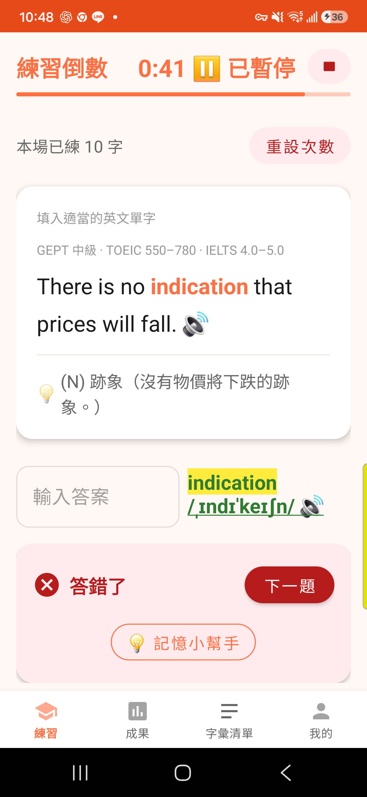
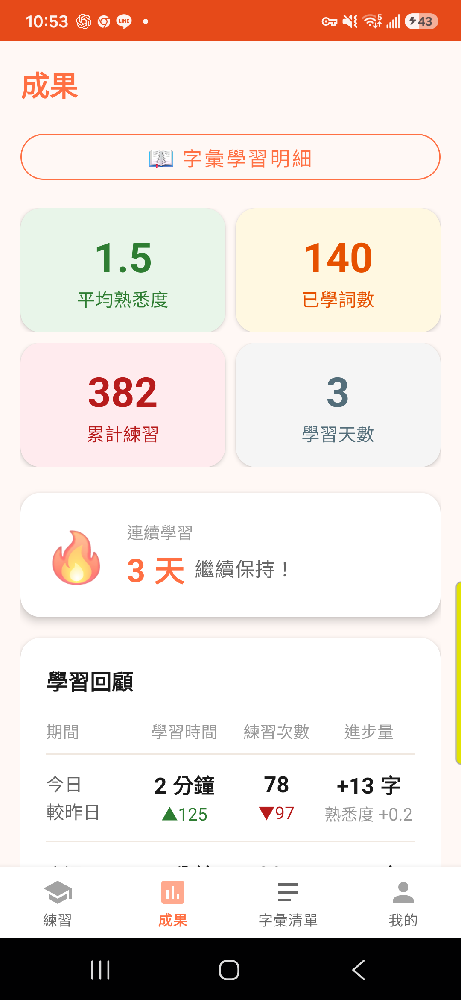
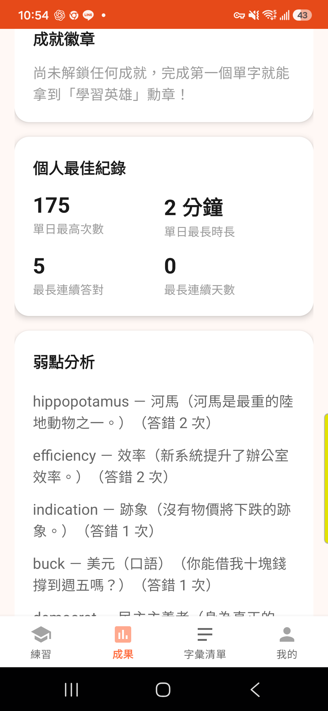

# TutorDan 英語字彙學習 App

專為 GEPT 全民英檢設計的 Android 字彙練習 App。採「計時制」練習搭配 FSRS 記憶排程演算法，依每個單字的熟悉程度智慧安排複習時機，並用 AI 生成的單字學習卡輔助記憶。

> 本 repo 專門存放可安裝的 APK 檔案與功能說明，方便直接下載安裝測試。原始碼另外維護。

---

## 📥 下載安裝

暫無下載，敬請期待。

---

## 📖 建議學習方式

1. **先練習字卡**：依畫面提示直接作答（拼出正確單字）
2. **答完後針對不熟的字加強**：查看音標發音與例句，幫助記住正確唸法與用法
3. **善用「記憶小幫手」（Tips）頁面**：對還不熟的字，點開 Tips 頁面看 AI 生成的學習卡（拆字記憶、相近字比較、用法說明、例句、易錯拼字提醒等），加深對這個字的印象
4. **Tips 內容僅供輔助參考**：內容由 AI 生成，如果發現有錯誤的地方，歡迎直接在該則內容按「倒讚」回饋給我們，我們會持續檢視並更新有問題的部分

---

## ✨ 功能特色

### 📝 計時制練習
- 以填空題型考單字拼寫：句子中挖空一個單字，依上下文與中文提示作答
- 每場練習以設定的分鐘數為準，時間到自動結算，過程中無縫向伺服器續抓題目
- 答錯或「我不知道」的字會間隔幾張後再次出現，不會死記硬背也不會連續鑽同一題
- 「我已會了」可直接跳過已經很熟的字

### 🧠 智慧記憶排程
- 採 FSRS（Free Spaced Repetition Scheduler）演算法，依每次作答表現動態計算下次複習時間
- 熟悉度不足的字會提前複習、已熟悉的字拉長複習間隔，避免無謂重複
- 依學習狀況自動控管每日新字發放量，複習量過高時會暫緩發放新字，避免學習壓力過大

### 💡 記憶小幫手（AI 學習卡）
- 針對每個單字，AI 即時生成一張結構化學習卡：意思、拆字記憶、相近字比較、用法說明、常見搭配、例句、易錯拼字提醒、推薦記憶法
- 可對學習卡按讚 / 倒讚，幫助未來優化內容

### 🏆 成就徽章
- 學習里程碑（連續學習天數、熟悉字數、累計練習量、GEPT 等級提升等）達成即解鎖對應徽章
- 解鎖當下會立即彈出動畫慶祝：畫面中心圓形展開＋徽章彈跳放大＋光芒特效＋慶祝音效
- 成果頁的徽章牆可以點一下任何已解鎖的徽章，重播該徽章的解鎖動畫

### 📊 學習成果總覽
- 平均熟悉度、已學詞數、累計練習次數、學習天數、連續學習天數（🔥 streak）
- 今日 / 本週 / 本月學習回顧，各項數據都會跟上一期比較（▲進步 ▼退步）
- 個人最佳紀錄：單日最高練習次數、單日最長時長、最長連續答對、最長連續學習天數
- 弱點分析：列出答錯次數最多的字，方便針對性加強
- 學習曲線圖：近 14 天平均熟悉度趨勢

### 🌐 英語程度對照
- 依實際練習表現（而非單純作答次數）推估目前程度
- 同時換算對照 GEPT 全民英檢／CEFR／TOEIC 多益／IELTS 雅思四套量尺
- 程度評估測驗：15 題定級測驗，快速抓出目前程度

### 🥇 匿名排行榜
- 登入後可查看自己在全體會員、以及同程度會員中的排名百分位
- 僅比較已登入會員的資料，避免同一人多裝置灌水

### 📚 字彙管理
- 字彙清單可搜尋、瀏覽已下載的所有單字
- 字彙學習明細：查詢每個單字的歷史練習時間軸
- 字彙依 GEPT 1～4 等級 ＋ 多元主題分類（生活、職場、科技、旅遊、遊戲、電影等）

### 👤 帳號與同步
- 支援 Google 登入，學習進度跨裝置同步
- 未登入也可使用（匿名模式，有取字上限）
- 支援切換測試帳號，方便多帳號測試

### ⚙️ 其他貼心設計
- 每日學習目標分鐘數設定，達標會有恭喜提示
- TTS 語音朗讀單字／例句，可調整語速
- 該等級字都熟悉後會提示自動升級到下一個 GEPT 等級

---

## 📸 畫面截圖

| 練習頁 | 成果頁總覽 | 個人紀錄與弱點分析 |
|---|---|---|
|  |  |  |

- **練習頁**：填空題型、GEPT/TOEIC/IELTS 等級標註、中文提示、「記憶小幫手」入口
- **成果頁總覽**：平均熟悉度、已學詞數、累計練習、學習天數、連續學習天數、學習回顧表格
- **個人紀錄與弱點分析**：成就徽章牆、個人最佳紀錄、答錯最多的弱點單字列表
